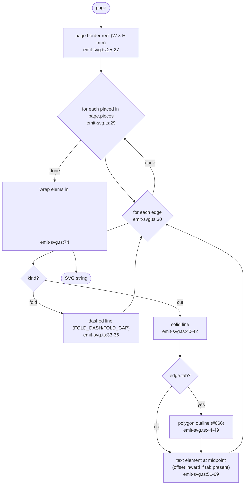

# F5 — Output assembly (tabs → paginate → emit)

Three pure stages from `RecutResult` to per-page SVG strings.

## buildRenderablePieces happy path

```mermaid
flowchart TD
  Start([recut: RecutResult]) --> CutIdx["index cuts by canonicalEdgeKey;<br/>label = k+1 (1-based)<br/>tabs.ts:64-71"]
  CutIdx --> Pieces{"for each piece<br/>tabs.ts:73"}
  Pieces --> FoldSet["foldKeys = Set of canonicalEdgeKey(fold.edge)<br/>tabs.ts:74-77"]
  FoldSet --> Faces{"for each face k in piece.layout.faces<br/>tabs.ts:80-81"}
  Faces --> EdgeLoop{"for i in 0..2 (3 edges)<br/>tabs.ts:83"}
  EdgeLoop --> Classify{"foldKeys has key?"}
  Classify -->|yes| FoldE["push { kind: 'fold', from, to }<br/>tabs.ts:92"]
  Classify -->|no| CutEntry{"cutByKey.get(key)"}
  CutEntry -->|missing, throw| ErrNeither([Error: neither fold nor cut])
  CutEntry -->|present| TabSide{"meshFace === entry.adj.faceA?"}
  TabSide -->|yes| MakeTab["buildTab(pa, pb, apex):<br/>trapezoidal flap outward<br/>tabs.ts:37-59"]
  TabSide -->|no| NoTab["tab = null (paired side)"]
  MakeTab --> CutE["push { kind: 'cut', from, to, label, tab }<br/>tabs.ts:105-111"]
  NoTab --> CutE
  FoldE --> EdgeLoop
  CutE --> EdgeLoop
  EdgeLoop -->|done| Faces
  Faces -->|done| Pieces
  Pieces -->|done| Out([RenderablePiece[] { edges }])
```

## paginate happy path

```mermaid
flowchart TD
  Start([pieces, page]) --> Empty{pieces empty?}
  Empty -->|yes| OutEmpty([return []])
  Empty -->|no| Print["printableW = W - 2·margin;<br/>printableH = H - 2·margin<br/>paginate.ts:104-110"]
  Print --> BBoxes["for each piece: computeBbox over edge from/to/tab<br/>paginate.ts:51-70, 112-120"]
  BBoxes --> Scale["s = min(min(printableW/b.w, printableH/b.h))<br/>uniform fit-to-page across all pieces<br/>paginate.ts:122-128"]
  Scale --> Order["sort indices by scaled height desc (tallest first)<br/>paginate.ts:130-136"]
  Order --> Shelf{"shelf packing<br/>paginate.ts:138-178"}
  Shelf --> Fit{"x + w·s > printableW?"}
  Fit -->|yes| NewShelf["shelfTop += h + gutter; x=0"]
  Fit -->|no| FitH{"shelfTop + h·s > printableH?"}
  NewShelf --> FitH
  FitH -->|yes| PushP["pushPage(); reset shelf<br/>paginate.ts:144-151, 164-167"]
  FitH -->|no| Place
  PushP --> Place["transformPiece(piece, bbox, ox, oy, s)<br/>paginate.ts:72-96, 172-175"]
  Place --> Advance["x += w·s + gutter;<br/>update shelfHeight<br/>paginate.ts:176-177"]
  Advance --> NextPiece{"more pieces?"}
  NextPiece -->|yes| Shelf
  NextPiece -->|no| FinalPush["if current non-empty, pushPage<br/>paginate.ts:179"]
  FinalPush --> Out([Page[] with millimetre coordinates])
```

## emitSvg happy path



## Side effects

None — all three stages pure. Output is a string (SVG markup).

## External dependencies

- F4 (consumes `RecutResult`)
- Output (`svg` string) handed to F6 for DOM insertion.

## Notes for duplication phase

- `canonicalEdgeKey` defined at [tabs.ts:30-31](src/core/tabs.ts:30) — third copy of the same lexical pattern across the codebase.
- `paginate` and `emit-svg` are tightly coupled by the millimetre convention ([paginate.ts:1-5](src/core/paginate.ts:1), [emit-svg.ts:3-5](src/core/emit-svg.ts:3)) — not a duplication, but worth noting as a shared invariant.
