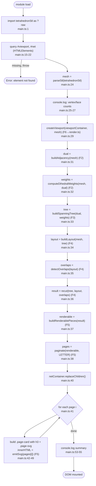
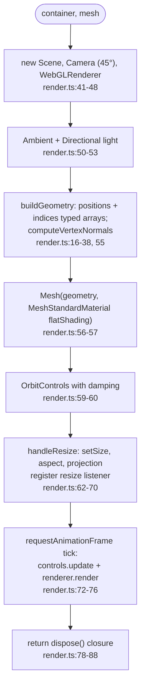

# F6 — Application shell

Wires the F1→F5 pipeline at module-load time on a hardcoded tetrahedron input, mounts the 3D preview, and inserts each page's SVG into the DOM.

## main.ts happy path

## render.ts happy path

## Side effects

- DOM: queries `#viewport` and `#net`, appends WebGL canvas, replaces children of net container with page cards. ([main.ts:15-22, 40-51](src/app/main.ts:15), [render.ts:48](src/app/render.ts:48))
- Window: `resize` listener; `requestAnimationFrame` loop ([render.ts:70-75](src/app/render.ts:70)).
- Console: two `console.log` calls in main.ts ([main.ts:25-27, 53-55](src/app/main.ts:25)).

## External dependencies

- F1, F2, F3, F4, F5 (entire pure pipeline)
- External libs: `three`, `three/examples/jsm/controls/OrbitControls`.
- Vite `?raw` import for embedded `test/corpus/tetrahedron.stl` fixture.

## Notes for duplication phase

- The input is **hardcoded** to `tetrahedron.stl` ([main.ts:1, 24](src/app/main.ts:1)). There is no file picker / drop zone / format dispatcher — `parseObj` exists and is tested but the app cannot reach it. This is "missing capability" rather than duplication, but it surfaces the absence of a parser dispatch.
- The pipeline call sequence (parse → adjacency → weights → tree → layout → overlap → recut → tabs → paginate → emit) is duplicated literally between [main.ts:24-38](src/app/main.ts:24) and [scripts/baseline-pipeline.ts](scripts/baseline-pipeline.ts) — both walk the same eight calls in the same order with different inputs and side-effect sinks. (Baseline script not shown in this flowchart but confirmed via corpus.)
