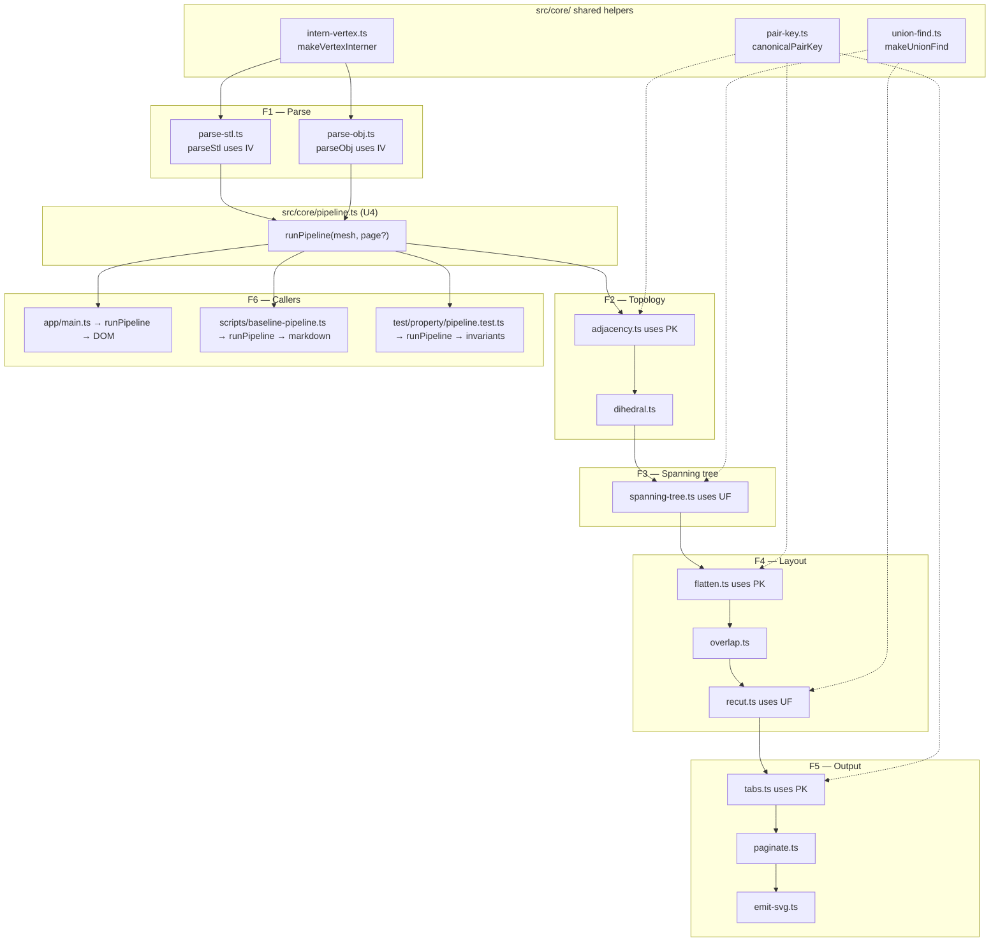

# Unified proposal

Four small, independent consolidations. None of them changes the pipeline's algorithm or external API surface — each replaces N copies of a private helper with one shared module. The proposal favours **deletion over abstraction**: no registries, no factories, no flags.

The proposed file additions are minimal:
- `src/core/pair-key.ts` (one exported function, ~3 LOC)
- `src/core/union-find.ts` (one exported factory, ~35 LOC)
- `src/core/intern-vertex.ts` (one exported factory, ~15 LOC)
- `src/core/pipeline.ts` (one exported orchestrator, ~25 LOC)

## U1 — `src/core/pair-key.ts`

**Single entry point:** `canonicalPairKey(a: number, b: number): string`

Resolves D1. One file, one export, one body line:

```ts
export const canonicalPairKey = (a: number, b: number): string =>
  a < b ? `${a},${b}` : `${b},${a}`;
```

**Call-site rewrites:**

| Old | New |
|---|---|
| `canonicalEdgeKey` in [adjacency.ts:39-40](src/core/adjacency.ts:39) | delete; import `canonicalPairKey` from `./pair-key.js` |
| `canonicalPairKey` in [flatten.ts:37-38](src/core/flatten.ts:37) | delete; import from `./pair-key.js` |
| `canonicalEdgeKey` in [tabs.ts:30-31](src/core/tabs.ts:30) | delete; import from `./pair-key.js` |

**Capability lost:** none. The three implementations are byte-for-byte equivalent.

## U2 — `src/core/union-find.ts`

**Single entry point:** `makeUnionFind(n: number): { find, union }`

Resolves D2. Lift the existing `makeUnionFind` factory from [spanning-tree.ts:44-77](src/core/spanning-tree.ts:44) verbatim into its own file. The semantics — `union` returns `true` iff a merge actually happened — already match what `recut`'s `connectedComponents` needs; that function currently throws away the boolean by writing `void`, so adopting the factory is a strict no-op behavioural change for it.

**Call-site rewrites:**

| Old | New |
|---|---|
| `makeUnionFind` + `UnionFind` interface in [spanning-tree.ts:38-77](src/core/spanning-tree.ts:38) | delete; import from `./union-find.js` |
| Inline `ufParent`/`rank`/`find`/`union` in [recut.ts:183-208](src/core/recut.ts:183) (the `connectedComponents` helper) | replace with `const uf = makeUnionFind(faceCount); … uf.union(fold.faceA, fold.faceB); … uf.find(i);` |

**Capability lost:** none.

## U3 — `src/core/intern-vertex.ts`

**Single entry point:** `makeVertexInterner(): { intern(x, y, z): number; vertices: Vec3[] }`

Resolves D4. Lift the shared `internVertex` + `vertices[]` + `vertexIndex: Map` triple from the two parsers into one factory. Each parser keeps its own format-specific outer loop (per N1, that's legitimate specialization) but calls `interner.intern(x, y, z)` instead of carrying its own copy.

```ts
export function makeVertexInterner() {
  const vertices: Vec3[] = [];
  const index = new Map<string, number>();
  const intern = (x: number, y: number, z: number): number => {
    if (!Number.isFinite(x) || !Number.isFinite(y) || !Number.isFinite(z)) {
      throw new Error(`intern-vertex: non-finite coordinate (${x}, ${y}, ${z}).`);
    }
    const key = `${x.toFixed(6)},${y.toFixed(6)},${z.toFixed(6)}`;
    const existing = index.get(key);
    if (existing !== undefined) return existing;
    const idx = vertices.length;
    index.set(key, idx);
    vertices.push([x, y, z]);
    return idx;
  };
  return { intern, vertices };
}
```

**Call-site rewrites:**

| Old | New |
|---|---|
| `internVertex` closure + `vertices[]` + `vertexIndex` in [parse-stl.ts:20-32](src/core/parse-stl.ts:20); finiteness check at [parse-stl.ts:44-46](src/core/parse-stl.ts:44) | `const verts = makeVertexInterner();` → `verts.intern(x,y,z)`; drop the local finiteness check (now inside `intern`); return `{ vertices: verts.vertices, faces }` |
| `internVertex` closure + `vertices[]` + `vertexIndex` in [parse-obj.ts:18-31](src/core/parse-obj.ts:18); finiteness check at [parse-obj.ts:64-68](src/core/parse-obj.ts:64) | same shape |

**Capability lost:** the per-format error messages ("parseStl: non-finite vertex coordinate in line: …" / "parseObj: …") collapse to a single "intern-vertex: non-finite coordinate (x, y, z)." form. This drops the offending source-line text from the message. Acceptable: the line is already in the parser's local scope; if line context turns out to matter, each parser can wrap `intern` with a try/catch and re-throw with format-specific context, but no existing test depends on the line text.

## U4 — `src/core/pipeline.ts`

**Single entry point:** `runPipeline(mesh: Mesh3D, page: PageSpec = LETTER): { layout, tree, recut, renderable, pages }`

Resolves D3. One function that runs every pure stage and returns the intermediate values so each caller can pick the slice it needs. Callers stop encoding the call order.

```ts
export function runPipeline(mesh: Mesh3D, page: PageSpec = LETTER) {
  const dual = buildAdjacency(mesh);
  const weights = computeDihedralWeights(mesh, dual);
  const tree = buildSpanningTree(dual, weights);
  const layout = buildLayout(mesh, tree);
  const overlaps = detectOverlaps(layout);
  const recutResult = recut(tree, layout, overlaps);
  const renderable = buildRenderablePieces(recutResult);
  const pages = paginate(renderable, page);
  return { dual, weights, tree, layout, overlaps, recut: recutResult, renderable, pages };
}
```

**Call-site rewrites:**

| Old | New |
|---|---|
| [main.ts:31-38](src/app/main.ts:31) (8 imports + 8 sequential calls) | `const { pages } = runPipeline(mesh);` then loop over `pages` to emit SVG into DOM |
| [scripts/baseline-pipeline.ts:74-128](scripts/baseline-pipeline.ts:74) (six try/catch blocks around the same calls) | `try { const { overlaps, recut: r, pages } = runPipeline(mesh); … } catch (e) { r.pipeline = \`failed at ${stage}\`; }` — collapse six stage-named catches to one (or, if the staged failure labels are valuable, expose stage names via a discriminated error type) |

**Capability lost:** the baseline harness's per-stage `failed at X` labels become coarser unless the orchestrator emits stage-tagged errors. Acceptable: this harness is internal tooling, not a user-facing report, and "failed at parse vs failed at recut" can be reconstructed from the error message or a stage tag on a thrown error type.

**Anti-patterns to avoid in U4:**
- No "configurable" pipeline (no stage list, no plugin array). One sequence, one function.
- No streaming callbacks ("onStage(name, value)") to support the baseline harness — if the harness needs per-stage labels, throw a `StageError { stage, cause }` and let the harness pattern-match.
- No backwards-compatibility re-exports of the deleted per-stage imports from main.ts. Delete cleanly.

## Combined proposed flowchart



(Solid arrows: data flow. Dotted: "uses helper".)

## Net change estimate

| Action | Files | Approximate diff |
|---|---|---|
| Add | `src/core/pair-key.ts`, `src/core/union-find.ts`, `src/core/intern-vertex.ts`, `src/core/pipeline.ts` | +~80 LOC across 4 new files |
| Delete inline helpers | adjacency.ts, flatten.ts, tabs.ts, spanning-tree.ts, recut.ts, parse-stl.ts, parse-obj.ts | −~120 LOC |
| Rewrite orchestrators | app/main.ts, scripts/baseline-pipeline.ts | −~50 LOC net |
| **Net** | | **~−90 LOC**, four new top-level helpers, no behaviour change |

The four consolidations are mutually independent — U1, U2, U3, U4 can be done in any order or skipped individually with no downstream impact. The handoff prompts in `04-handoff-prompts.md` reflect this.
